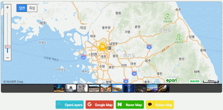

# X MapManager 통합 Map관리 도구
X MapManager는 OpenLayers, Google Map, Kakao Map, Naver Map을 복잡한 설정없이 쉽고 빠르게 적용이 가능 합니다.

  
### 라이브 데모
 * 데모 : <a href="https://www.epari.net/webapp/xmapManager.do"         target="_blank">https://www.epari.net/webapp/xmapManager.do</a>
 * 설치 : <a href="https://www.epari.net/webapp/xmapManagerInstall.do"  target="_blank">https://www.epari.net/webapp/xmapManagerInstall.do</a>
 * 문서 : <a href="https://www.epari.net/webapp/xmapManagerDocument.do" target="_blank">https://www.epari.net/webapp/xmapManagerDocument.do</a>
 
 

### Google Map Example

### Kakao Map Example

### Naver Map Example

### OpenLayers Map Example

### GeoJson Korea Map Example

### GeoJson World Map Example

### Layers Carto Example

### Layers Esri Example

### Layers Mapbox Example

### Layers MapTiler Example

### Layers Stamen Example

 
 

### X MapManager 주요기능
* 4가지 맵(OpenLayers, Google Map, Naver Map, Nate Map)을 한번의 설정으로 운용이 가능 합니다.
* Marker Label Index로 원하는 Marker로 쉽고 빠르게 이동이 가능 합니다.
* Marker와 Label을 Line Traker로 직관적인 위치 파악이 가능 합니다
* 여러가지 내장 Marker Icon(marker01 ~ marker12)을 사용 하거나 외부 Icon을 URL Link로 사용 가능 합니다.
* OpenLayers의 다중 Layer설정으로 여러가지 Map Source를 적용이 가능 합니다.
* Options를 설정 없이 {}로만 설정해도 모든 기능이 기본 동작으로 설정 됩니다.
* API기능으로는 "setMapMarkerListAppend([])", "setMapMarkerListRemove(index)", "setMapMarkerListRemoveAll()", "setMapChange('Google')"등을 사용합니다. 

### X MapManager 라이센스
아래 조건을 충족할 경우 모든 사용자에게 무료 입니다.

* X MapManager의 지적 재산권은 epari에 있습니다.
* X MapManager은 개인 및 기업 사용자를 포함한 모든 사용자에게 무료로 제공되며 자유롭게 사용 하실 수 있습니다.
* X MapManager은 일부를 수정, 판매할 수 없으며 배포되는 형태 그대로 사용해야 합니다.

 
